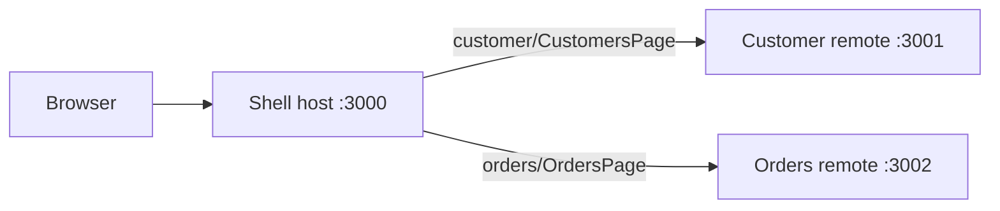

# React Federated Microsite

A pnpm monorepo demonstrating a small React microsite composed from independently built applications with Module Federation. The `shell` app is the host; `customer` and `orders` are remote apps loaded by the shell at runtime.

> **Project status:** This is a working federation prototype. Authentication is planned but not implemented, and the customer and orders content is placeholder UI. Do not treat the current routes as protected or the app as production-ready.

## Architecture



- **Shell** owns the top-level navigation and routes. It loads the remote pages on `/customers/*` and `/orders/*`.
- **Customer** exposes `./CustomersPage`, available in the shell under `/customers`.
- **Orders** exposes `./OrdersPage`, available in the shell under `/orders`.
- React, React DOM, and React Router are shared between host and remotes.
- If a remote cannot be loaded, the shell keeps its navigation available and displays a generic error fallback for that section.

## Technology

- React 19 and TypeScript
- Vite 8
- `@originjs/vite-plugin-federation`
- React Router
- pnpm workspaces

## Requirements

- Node.js `^20.19.0` or `>=22.12.0`
- pnpm `12.8.1` (pinned in the root `package.json`)
- `lsof` to use the root `pnpm stop:dev` helper

## Get Started

Install dependencies from the repository root:

```bash
pnpm install
```

Build all three apps. The sequential workspace setting keeps builds from competing for resources:

```bash
pnpm -r --workspace-concurrency=1 build
```

The host runs in Vite development mode, while the remotes must be built and served so their generated `remoteEntry.js` files are available. Start each command in its own terminal from the repository root.

**Terminal 1: customer remote**

```bash
pnpm --filter customer exec vite preview --host 127.0.0.1 --port 3001 --strictPort
```

**Terminal 2: orders remote**

```bash
pnpm --filter orders exec vite preview --host 127.0.0.1 --port 3002 --strictPort
```

**Terminal 3: shell host**

```bash
pnpm --filter shell exec vite --host 127.0.0.1 --strictPort
```

Open <http://127.0.0.1:3000/>. The host loads the remote entries from ports `3001` and `3002`; those remote servers need to be running for their pages to load.

### Stop the apps

Stop the suite from the repository root:

```bash
pnpm stop:dev
```

This sends `SIGTERM` to processes listening on ports `3000`, `3001`, and `3002`. Check that those ports are not being used by unrelated services before running it. To preview which processes would be stopped without stopping them:

```bash
DRY_RUN=1 pnpm stop:dev
```

Alternatively, press `Ctrl+C` in each app terminal.

## Validate

Build every app and run ESLint across the workspace:

```bash
pnpm -r --workspace-concurrency=1 build
pnpm -r lint
```

Each app also provides `dev`, `build`, `lint`, and `preview` scripts. Because the federation setup requires built remote entries, use the commands above for the full local experience rather than starting all three apps with `pnpm -r dev`.

## Repository Layout

```text
apps/
  shell/       Federation host, top-level routes, and navigation
  customer/    Customer remote exposing CustomersPage
  orders/      Orders remote exposing OrdersPage
scripts/
  stop-dev.sh  Stops listeners on the suite's local ports
pnpm-workspace.yaml
```
